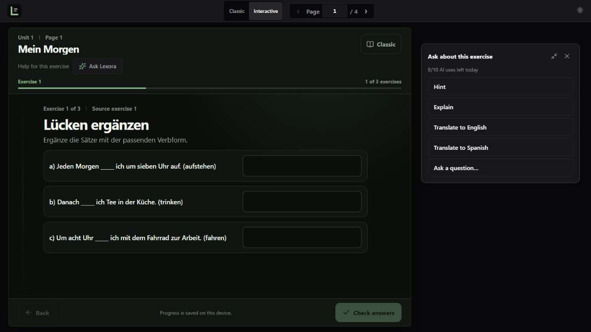
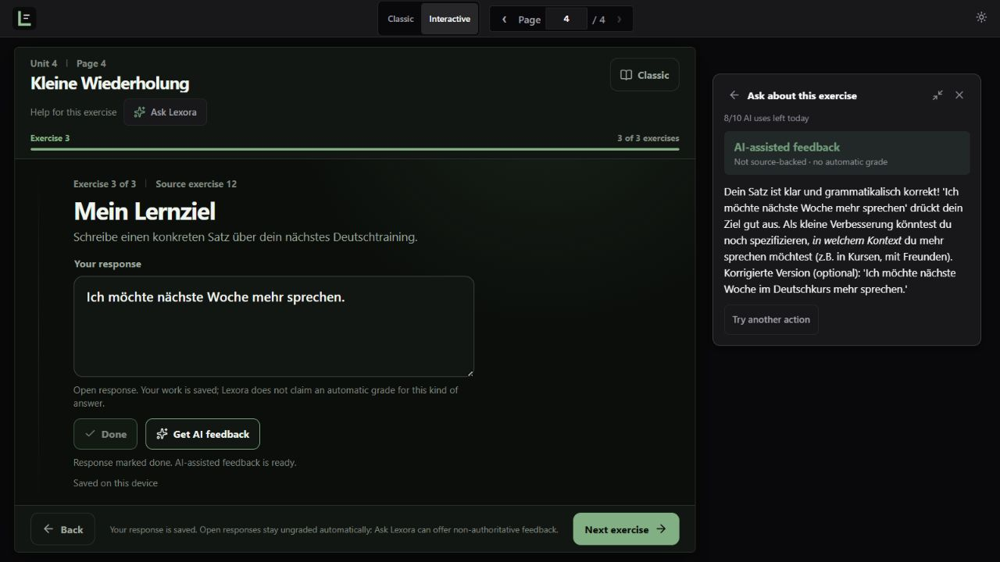
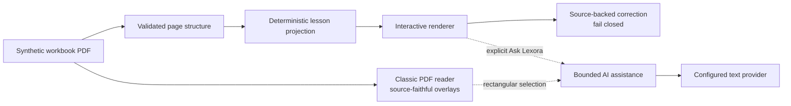

# Lexora

Lexora turns scanned language workbooks into focused, interactive practice while keeping the original page available at any time. Learners can work with native exercises in Interactive Mode or switch to Classic Mode for a source-faithful workbook view.

The repository includes a precomputed public demo using an original four-page synthetic workbook. Run it locally at `http://127.0.0.1:8088/demo`; opening the demo does not start document processing or analysis inference. When contextual assistance is enabled and configured, an explicit learner action can use the bounded AI-help path.

| Interactive Mode | Classic Mode |
|---|---|
|  |  |
| Ask Lexora with Hint, Explain, Translate, and question actions | AI-assisted feedback for a true open response, explicitly labeled non-authoritative |
|  |  |

## Classic Mode and Interactive Mode

| Mode | Best for | How it works |
|---|---|---|
| **Interactive** | Focused practice | Projects supported source exercises into responsive native controls. Correction is deterministic and source-backed when a canonical answer exists. |
| **Classic** | Source fidelity | Preserves the original PDF with geometry-aligned interactive overlays and the same answer state. |

Interactive Mode supports context, fill blank, choice, choice grid, sentence ordering, matching, and true open responses. Both modes use the same browser-local answers, so learners can switch views without losing progress. Switching modes changes the projection, not the underlying validated page analysis or correction authority.

When a canonical answer mapping is reliable, Lexora is the authority for correct/incorrect feedback. Unmapped, ambiguous, and true open responses remain explicitly ungraded rather than guessed.

## Ask Lexora

Ask Lexora is an explicit, secondary help path—not an automatic chatbot or grading replacement.

- **Hint** gives bounded help for the current exercise or selected Classic content.
- **Explain** provides a contextual explanation.
- **Translate** translates reliable source context to English or Spanish.
- **Ask a question** sends a bounded learner question with the current exercise or selection as context.
- **Get AI feedback** is available after a true open response is marked done. It offers AI-assisted review, clearly labeled **not source-backed**, and never creates an automatic grade.

In Interactive Mode, Ask Lexora uses the current exercise. In Classic Mode, the learner must make an explicit rectangular page selection. The backend reconstructs canonical context, refuses unreliable source context, keeps provider credentials server-side, and applies human verification, session limits, a global provider limit, caching, and a kill switch.

## How it works

1. A private/local workflow rasterizes a workbook page for multimodal analysis.
2. The result is validated as a typed page structure with source geometry and interaction identity.
3. Supported structures become native exercises in Interactive Mode.
4. The original page remains available in Classic Mode.
5. The public demo serves committed, validated results; explicit Ask Lexora actions use a separate bounded assist request.

New document analysis is available only through the private local workflow. The public reader performs projection, answer persistence, source-backed correction, and optional explicit assistance at runtime.

## Engineering highlights

- **Source fidelity:** Interactive exercises retain their connection to the original page, wording, and geometry.
- **Fail-closed correction:** Only reliable source-backed mappings produce correct or incorrect feedback. Missing or ambiguous answers remain explicitly ungraded.
- **Precomputed public demo:** Visitors use precomputed multimodal analysis and cannot trigger document processing or analysis inference. The public demo may still expose explicit, provider-backed assistance when it is enabled and configured.
- **Optional contextual AI help:** **Ask Lexora** stays next to the current exercise in Interactive Mode; Classic uses an explicit rectangular page selection. Hint, Explain, Translate, Ask a question, and open-response AI feedback are bounded, explicit actions. AI review is non-authoritative and never replaces deterministic source-backed correction.
- **Bounded public assistance:** Turnstile verification, a per-session daily quota, a global daily provider quota, response caching, and a kill switch protect the provider path. The default Compose limits are 10 AI uses per verified session per day and 100 provider calls globally per day.
- **Tested interaction model:** Automated coverage spans all six exercise families, responsive layouts, keyboard operation, accessibility, correction, and the public read-only boundary.

## Architecture



Lexora separates document analysis from the public reading experience. The public runtime contains the web app, API, database, and an internal, non-exposed AI service that is only contacted when a learner explicitly triggers optional AI help. The private local workflow adds multimodal document analysis.

| Layer | Stack | Role |
|---|---|---|
| Web | React, TypeScript, Vite, PDF.js | Public site, Interactive lessons, browser-local progress, and the lazy-loaded Classic reader |
| API | Java, Spring Boot, PostgreSQL, PDFBox | Books, page orchestration, correction authority, public-demo enforcement, and the bounded AI-help endpoint |
| AI help | Python, FastAPI | Optional, user-triggered Hint / Explain / Translate / Ask a question / open-response feedback; internal-only, provider-agnostic |
| Analysis | Python, FastAPI, multimodal AI | Private document analysis and strict structure validation; absent from the public runtime |

See [the architecture reference](docs/architecture.md) for both runtime topologies and [the public release runbook](docs/public-release.md) for operational verification.

## Run the public demo

Prerequisite: Docker Desktop with Compose. The precomputed lesson does not require a provider credential. The production stack includes an internal AI-help service, but `LEXORA_ASSIST_ENABLED` defaults to `false`; configure a server-side provider and real Turnstile credentials before enabling Ask Lexora in a deployment.

```powershell
$env:POSTGRES_PASSWORD = '<strong-random-secret>'
$env:LEXORA_HTTP_PORT = '8088' # optional
docker compose -p lexora-public -f compose.production.yml up -d --build --wait
```

Open `http://127.0.0.1:8088` for the public site or `http://127.0.0.1:8088/demo` for the reader. The stack binds to loopback by default.

```powershell
docker compose -p lexora-public -f compose.production.yml down
```

For loopback-only public-boundary QA with the development compose file, use the documented test Turnstile keys:

```powershell
docker compose -f docker-compose.yml -f compose.public-local.yml up -d --build --wait
```

Open `http://127.0.0.1:8088/demo`; this remains the curated synthetic workbook and does not expose Upload PDF, DEV, Process, or Update analysis. Stop it with the same files and `down`.

For private local document analysis and development setup, follow [the public/private runtime runbook](docs/public-release.md). Credentials and private documents must never be committed.

## Testing and quality

Lexora tests page structures, correction mapping, every interaction family, responsive behavior, keyboard navigation, accessibility, the production shell, and the precomputed public-demo boundary.

```powershell
# Analysis service
docker compose --profile test run --rm --build ai-test

# Backend
cd backend
.\mvnw.cmd test

# Frontend
cd ..\frontend
npm ci
npm test
npm run build
npm run test:e2e
npm run test:e2e:production
npm run test:e2e:public-demo

# Public fixture integrity
cd ..
python scripts/public_demo_geometry.py --check
```

Browser suites cover dark and light themes, reduced motion, keyboard-only interaction, responsive viewports, production-only behavior, and the read-only demo API. The repository's CI runs frontend, backend, analysis-service, and backend/PostgreSQL integration checks.

## Public demo safety

The public demo is intentionally narrow:

- It serves one original synthetic workbook with precomputed multimodal analysis.
- Its production stack contains `frontend`, `backend`, `postgres`, and an internal-only AI service with no published port. No provider credential is required to run the precomputed lesson; provider credentials are required server-side only when optional assistance is enabled.
- Upload, processing, reanalysis, mutation, and access to arbitrary books are blocked.
- Opening or using the core demo cannot trigger document processing or analysis inference. An explicit Ask Lexora or open-response feedback action is the provider-bound path and may incur provider spend when enabled.
- Optional AI help runs only after an explicit learner action and is bounded by Turnstile verification, a per-session daily cap, a global daily provider cap, response caching, and a kill switch. The public UI reports the remaining session quota.
- Release verification checks `GET /api/public-demo` for the `precomputed-real-read-only` mode, `analysisTriggering: false`, and the committed provider/model metadata; upload, process, and update paths are not exposed by the demo.
- Private documents, derived captures, provider payloads, credentials, and local storage are excluded from public assets.

The private workflow remains available for authorized local PDFs, but it is not part of the public runtime. See the [release runbook](docs/public-release.md) for the complete boundary.

## Current limitations

- Unsupported or ambiguous layouts remain tied to the source rather than being guessed.
- True open responses are saved locally but are not automatically graded because they have no canonical answer mapping; after the learner selects **Done**, optional AI assistance can provide non-source-backed feedback.
- Authentication, accounts, cloud progress sync, and book-wide chat are not implemented.
- Public hosting, domain configuration, TLS, and operational backups remain deployment responsibilities.
- No license has been selected; until one is added, all rights are reserved.
