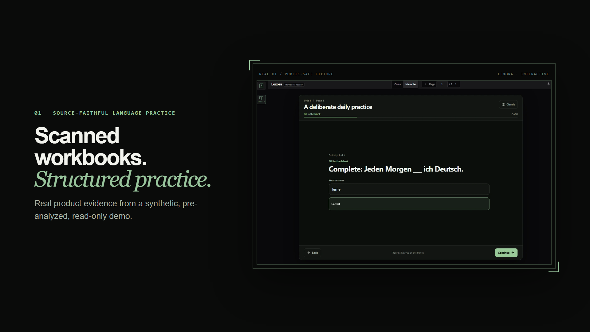
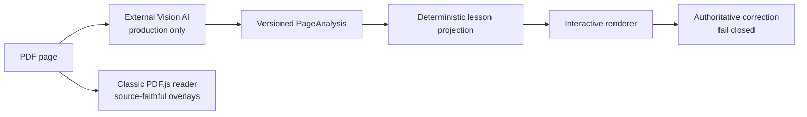

# Lexora

Lexora turns scanned language workbooks into focused interactive lessons while keeping the original page one click away. It is a portfolio-ready MVP built around a simple trust rule: transform what the source supports, and fail closed when it does not.

[](frontend/public/release/lexora-demo.mp4)

**Current release candidate:** a synthetic, pre-analyzed, read-only public demo; a production runtime that uses external Vision AI only; and complementary Interactive and Classic readers. No public deployment is performed by this repository.

## See it

- **Curated demo:** run the production stack below, then open `http://127.0.0.1:8088/demo`.
- **66-second product film:** [watch or download the caption-led MP4](frontend/public/release/lexora-demo.mp4).
- **Source:** this repository. A real public URL remains a deployment-time decision.

The demo uses deliberately created synthetic content. It cannot upload, process, delete, or expose arbitrary books, and opening it does not call the external provider.

## Why two readers?

| Mode | Job | Trust boundary |
|---|---|---|
| **Interactive** | Projects persisted page analysis into one responsive lesson step at a time. | Supported structures become native controls; correction is authoritative only when the backend resolves a source mapping. |
| **Classic** | Preserves the original PDF, geometry-aligned overlays, and exercise rail. | Unsupported or ambiguous material remains attached to the source instead of being invented. |

Interactive covers context, fill blank, choice, choice grid, sentence ordering, matching, and free text. Answers are stored in the current browser and shared across both modes.

## What is technically interesting?

- **AI at one boundary, deterministic behavior after it.** Production page analysis uses a concrete OpenAI Responses Vision provider and validates a strict, versioned `PageAnalysis` contract.
- **No local OCR in production.** The production AI image excludes PaddleOCR, PaddlePaddle, OpenCV, OCR modules, and local model downloads. Local OCR remains an explicit development provider.
- **Source-preserving projection.** The React lesson projector carries page, span, interaction, geometry, confidence, and processor provenance into the learner experience.
- **Fail-closed correction.** Only resolved backend mappings can produce correct or incorrect feedback. Ambiguous, unmapped, stale, or failed correction remains neutral.
- **Bounded public cost.** The public demo is pre-analyzed and read-only. Server-side filters block mutations, arbitrary book reads, and any public analysis trigger, so anonymous visitors cannot create provider spend.
- **A real fallback.** PDF.js is lazy-loaded only when Classic Mode is requested; it is not decorative duplicate UI.

## Architecture



The runtime is four containers: Nginx/React, Spring Boot, FastAPI, and PostgreSQL. Only Nginx is published; the other services remain on the internal Compose network. See [the architecture reference](docs/architecture.md) for the durable contracts and [the public release runbook](docs/public-release.md) for deployment-facing boundaries.

| Layer | Technology | Responsibility |
|---|---|---|
| Frontend | React 19, TypeScript 7, Vite 8, PDF.js 6 | Landing, native lessons, browser-local answers, lazy Classic reader |
| Backend | Java 21, Spring Boot 4.1, PostgreSQL 18, PDFBox | Books, page orchestration, profiles, correction authority, public-demo enforcement |
| AI service | Python 3.12, FastAPI, external OpenAI Vision in production | Bounded image analysis and strict contract validation |
| Development analysis | PaddleOCR 3.7, OpenCV 4.10 | Optional local compatibility path; absent from the production image |

## Quick start: curated public demo

Prerequisites: Docker Desktop with Compose and an authorized OpenAI API key. The demo itself is pre-analyzed, but the production AI service intentionally fails startup when its required provider credential is missing.

```powershell
$env:POSTGRES_PASSWORD = '<strong-random-secret>'
$env:OPENAI_API_KEY = '<authorized-provider-key>'
$env:LEXORA_HTTP_PORT = '8088' # optional
docker compose -f compose.production.yml up -d --build --wait
```

Open `http://127.0.0.1:8088` for the landing or `/demo` for the reader. The default binding is loopback-only. Stop this stack with:

```powershell
docker compose -f compose.production.yml down
```

Production Compose selects `LEXORA_ANALYSIS_PROVIDER=openai`, enables the curated public-demo boundary, limits requests and raster size, and uses a non-root AI runtime. Do not expose it on a public interface until authentication/reverse-proxy, TLS, domain, provider credential, and deployment smoke checks are complete.

## Local development

Development Compose retains the local OCR compatibility provider and the private upload/process workflow:

```powershell
Copy-Item .env.example .env
./scripts/dev-up.ps1
./scripts/dev-status.ps1
```

Open `http://localhost:5173`. Stop the stack with `./scripts/dev-down.ps1`. Private books belong only in ignored local storage and must never become fixtures, screenshots, logs, or release assets. To attach a page profile to a specific private upload during development, set `LEXORA_BOOK_PROFILE_CHECKSUM` and `LEXORA_BOOK_PROFILE_EDITION_KEY`; the repository itself ships no source-specific profile.

## Verification

```powershell
# AI service: production-safe suite without PaddleOCR
docker compose --profile test run --rm --build ai-test

# Backend
cd backend
./mvnw.cmd test

# Frontend
cd ../frontend
npm ci
npm test -- --run
npm run build
npm run test:e2e
npm run test:e2e:production
```

The mocked browser suite uses generated public-safe data. The opt-in full-stack suite accepts book IDs and representative pages only through process-local environment variables; see [the release runbook](docs/public-release.md#verification) rather than committing private identifiers.

## Reproduce the public assets

With the production stack at `http://127.0.0.1:18088`:

```powershell
cd frontend
$env:LEXORA_CAPTURE_BASE_URL = 'http://127.0.0.1:18088'
npm run capture:release

cd ../video
npm ci
npm run render
npm run poster
```

The capture script first verifies that `/api/public-demo` is curated, read-only, and unable to trigger analysis. Remotion renders a 66-second 1080p H.264 film from those real UI states with a two-worker memory boundary.

## Public versus private

Safe, intentional release material lives in:

- `backend/src/main/resources/demo/` — synthetic analysis and answer-key data;
- `frontend/public/release/` — selected screenshots, social image, poster, and final MP4;
- `video/public/evidence/` — real curated-demo states used by Remotion.

The private workbook, derived page captures, OCR dumps, answer-key dumps, provider payloads, local storage, credentials, and temporary browser/render output are not public assets and are not included.

## Current limits

- No authentication, accounts, cloud answer sync, vocabulary system, translation, book chat, or generated explanations.
- Not every publisher layout or answer-key shape is supported; unresolved content stays explicit.
- Public deployment, domain/DNS, TLS, and a bounded real-provider smoke remain deployment-time operations.
- No license has been selected. Adding one is an owner/legal decision; until then, all rights are reserved.
