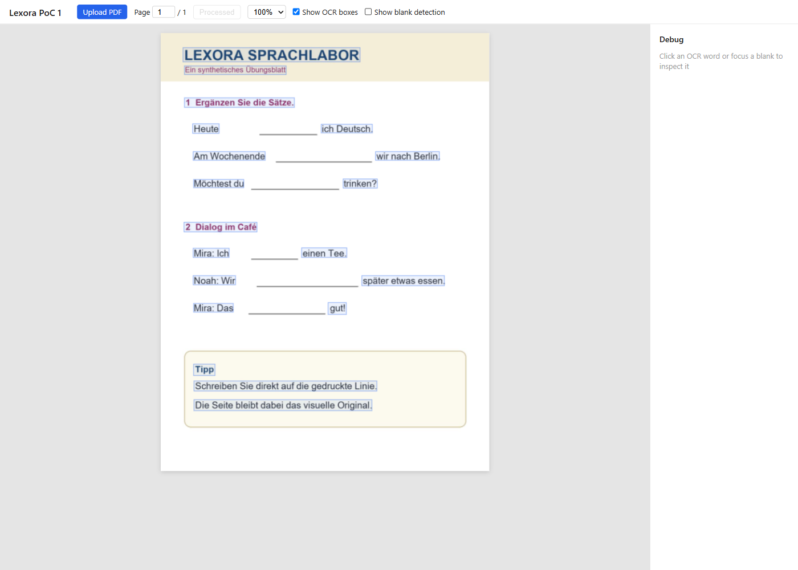
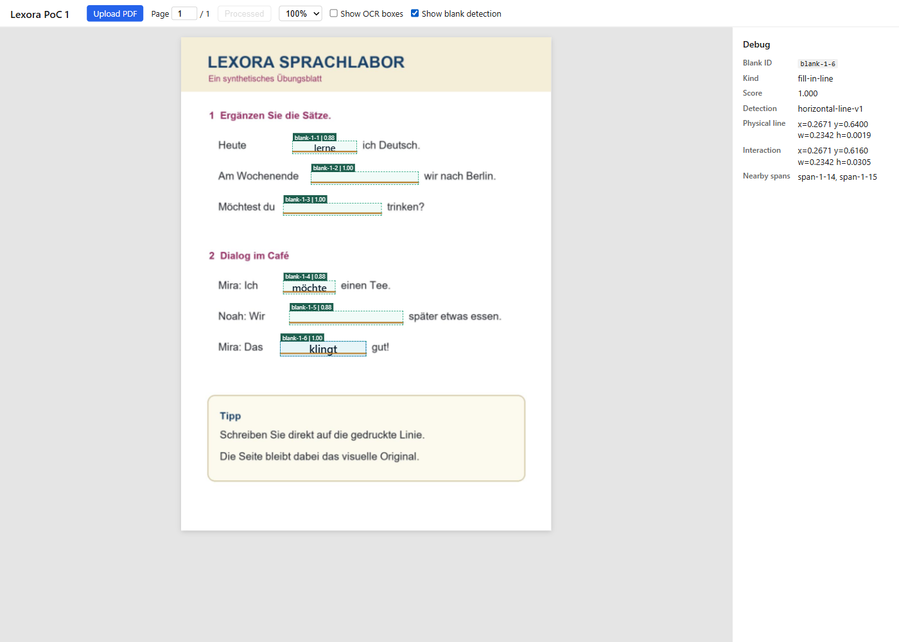
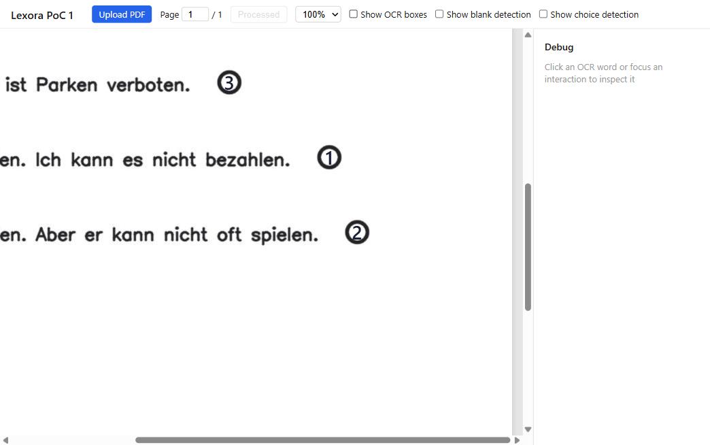

# Lexora

Some scanned language books lack selectable text, click-to-translate, vocabulary persistence, and interactive exercises. Lexora preserves the original page while adding the interactive learning tools that static scans are missing.

**Status:** Interactive Mode MVP release candidate. Lexora now offers two complementary readers: **Interactive** projects persisted page analysis into a native, responsive lesson; **Classic** preserves the original PDF and its geometry-aligned overlays. Both modes share one answer store and the backend's authoritative answer-key mapping.

## What Works Today

- Native Interactive lessons derived from persisted `PageAnalysis`, with no duplicate OCR or parallel content model
- Explicit Interactive / Classic mode switch, persisted per browser
- Responsive lesson navigation with clear unavailable, loading, failed, and empty states
- Native context, fill-in, choice, choice-grid, sentence-ordering, matching, and free-text blocks
- Source provenance on every projected block through page, span, interaction, geometry, confidence, and processor metadata
- Authoritative answer-key mapping with conservative `CORRECT`, `INCORRECT`, `UNANSWERED`, `AMBIGUOUS`, and `UNMAPPED` UI states; reveal and retry reuse the same page-bound correction contract
- Shared answers across Interactive and Classic, stored only in the current browser
- Scanned PDF upload and original-page rendering with PDF.js
- Explicit per-page processing through PDFBox and PaddleOCR
- Persisted `PageAnalysis` JSONB for each processed page
- Normalized OCR geometry in the `[0,1]` range
- Aligned overlays at 75%, 100%, 125%, 150%, 175%, and 200% zoom
- Clickable OCR spans with text, confidence, and geometry debug data
- Deterministic OpenCV detection of printed horizontal answer lines, including a conservative short-suffix path and table/grid line rejection
- Deterministic OpenCV detection of hollow circular choice markers with numbered option-set extraction from `1 = ...` legends
- Deterministic OpenCV detection of interactive choice grids (rows of empty answer cells under short column headers), rejecting static/explanatory grammar tables
- Deterministic OpenCV detection of sentence-ordering rows (separator-dot fragments) and matching exercises (aligned printed anchor dots)
- Deterministic OpenCV detection of free-text writing areas (isolated long writing-line stacks with prompt proximity), kept explicitly separate from FillBlank lines
- Persisted normalized physical and interaction geometry for blanks, choice targets, grid rows/cells, ordering items, matching items/anchors, and free-text response lines
- Transparent, keyboard-accessible inputs, choice targets, grid radio targets, ordering fragments, matching item buttons, and free-text writing inputs/textareas that scale with PDF zoom
- Compact anchored choice selector (option buttons + clear) with Escape/click-outside closing and arrow-key navigation
- Choice-grid rows as radio groups: one structured selection per row, replaced on change, with arrow-key navigation
- Click-to-order sentence fragments with floating per-exercise cards or a docked panel (one shared answer state)
- Click-to-pair matching: left → right pairing with thin SVG connection lines between printed anchors, one-to-one replacement, unpair, and per-exercise reset
- Free-text writing: single-line inputs or multi-line textareas aligned to the printed writing lines, with text persisted per browser/book/page
- Structured local answers per browser, book, and page: typed text for blanks, `targetId -> optionId` for choice markers, `rowId -> optionId` for grid rows, `orderedItemIds` for ordering, `leftItemId -> rightItemId` pairs for matching, raw learner text for free-text areas
- Separate OCR, blank-detection, choice-detection, grid-detection, ordering-detection, matching-detection, and free-text-detection debug overlays
- Immediate reuse of persisted `READY` pages without rerunning OCR
- In-page analysis overlay with real stage labels instead of a percentage bar
- Retry for `FAILED` pages
- Real coarse stages: `PENDING`, `RASTERIZING`, `OCR`, `DETECTING_INTERACTIONS`, `PERSISTING`, `READY`, `FAILED`
- Explicit **Update analysis** for legacy and pre-PoC 3 pages
- Book, selected page, and debug overlay preference restoration after refresh
- PDF-area loading skeleton during restoration
- Four-service Docker Compose development workflow
- Automated native-lesson journeys, Classic fallback, keyboard navigation, responsive overflow checks, and WCAG A/AA axe checks in Playwright

## Notes

- Exercise answers are stored only in the browser's `localStorage` under `lexora.exerciseAnswers.v1`. They persist across navigation and refresh, but are per-browser data, not cloud or user-account data.
- Answers are attached to a stable interaction fingerprint. If a page is reprocessed and a blank or choice target moves or its option group changes, the old answer is ignored rather than attached to the wrong interaction.
- Answers remain structured IDs and learner text rather than rendered coordinates. Correction is reported only when the authoritative answer-key mapping can resolve an interaction; unresolved or ambiguous content is never guessed.
- Interactive Mode is page-scoped by design. It fails closed when no persisted analysis exists and offers Classic as the faithful fallback.

## Not Implemented Yet

- Click-to-translate
- Contextual vocabulary persistence
- Generated explanations or AI-authored feedback
- Complete answer-key coverage for every publisher layout; unsupported mappings remain explicitly `UNMAPPED` or `AMBIGUOUS`
- Matching variants: one-to-many, many-to-many, image-to-text, no-anchor layouts
- Backend or account-based answer persistence
- Higher-level visual understanding
- Optional VLM or Gemini-based analysis
- RAG or book chat

## Architecture

| Layer | Technology | Responsibility |
|---|---|---|
| Frontend | React 19, TypeScript 7, Vite 8, PDF.js 6.2 | Native lesson projection/rendering, shared answer state, correction UI, and lazily loaded Classic PDF rendering |
| Backend | Java 21, Spring Boot 4.1, PDFBox, PostgreSQL 18 | Upload, rasterization, processing orchestration, persistence, and authoritative correction resolution |
| AI service | Python 3.12, FastAPI, PaddleOCR 3.7, OpenCV 4.10 | OCR, graphical blank/choice-marker/choice-grid/ordering/matching/free-text detection, normalization, and processor metadata |

See [`docs/architecture.md`](docs/architecture.md), [`docs/page-analysis.md`](docs/page-analysis.md), [`docs/exercise-detection.md`](docs/exercise-detection.md), [`docs/choice-interactions.md`](docs/choice-interactions.md), [`docs/choice-grid-interactions.md`](docs/choice-grid-interactions.md), [`docs/sentence-ordering-interactions.md`](docs/sentence-ordering-interactions.md), [`docs/matching-interactions.md`](docs/matching-interactions.md), and [`docs/free-text-interactions.md`](docs/free-text-interactions.md) for the durable technical contract.

## Demo

The screenshots use original synthetic pages processed by the real application. No workbook page is committed.

### OCR page analysis



### Interactive fill-in-the-blank overlay



### Choice-marker interaction with selected values



## Local Development

Prerequisite: Docker Desktop with Docker Compose on Windows, macOS, or Linux.

```powershell
./scripts/dev-up.ps1
```

Open <http://localhost:5173>, upload a scanned PDF, select a page, and choose **Process**. Services run detached; inspect them with:

```powershell
./scripts/dev-status.ps1
./scripts/dev-logs.ps1
./scripts/dev-down.ps1
```

Equivalent direct command:

```bash
docker compose up -d --build
```

## Production Containers

The production topology builds the React application into an Nginx image and packages Spring Boot into a non-root JRE image. Only the Nginx entrypoint is published; backend, AI, and PostgreSQL remain on the internal Compose network. Set a strong database password outside source control, then start the isolated production stack:

```powershell
$env:POSTGRES_PASSWORD = '<strong-random-secret>'
$env:LEXORA_HTTP_PORT = '8088' # optional; defaults to 8088
docker compose -f compose.production.yml up -d --build --wait
```

Open <http://localhost:8088>. Nginx serves the SPA, forwards `/api/*` to Spring Boot, allows workbook uploads up to 100 MB, and retains a five-minute processing timeout. Persistent data lives in the production Compose project's named PostgreSQL, model-cache, and workbook-storage volumes.

Inspect or stop this topology without affecting the development stack:

```powershell
docker compose -f compose.production.yml ps
docker compose -f compose.production.yml down
```

## Tests

```powershell
docker compose --profile test run --rm --build ai-test
cd backend; ./mvnw.cmd test
cd ../frontend; npm test -- --run
npm run build
npm run test:e2e
```

Playwright installs Chromium with `npx playwright install chromium`. The E2E suite uses a generated two-page PDF and mocked analysis/correction responses; it never requires or records a private workbook.

For release acceptance, an opt-in full-stack suite runs against an already profiled local workbook and makes no route mocks. Keep workbook identity and representative page numbers in process-local environment variables; never commit them:

```powershell
$env:LEXORA_E2E_BASE_URL = 'http://127.0.0.1:5173'
$env:LEXORA_E2E_BOOK_ID = '<local-profiled-book-id>'
$env:LEXORA_E2E_RESOLVED_PAGE = '<page-with-a-resolved-fill-blank>'
$env:LEXORA_E2E_CHOICE_PAGE = '<choice-page>'
$env:LEXORA_E2E_GRID_PAGE = '<choice-grid-page>'
$env:LEXORA_E2E_ORDERING_PAGE = '<ordering-page>'
$env:LEXORA_E2E_MATCHING_PAGE = '<matching-page>'
$env:LEXORA_E2E_FREE_TEXT_PAGE = '<free-text-page>'
npm run test:e2e:full-stack
```

This gate verifies real book/page/correction/source endpoints, conservative incorrect/reveal/retry behavior, Classic PDF canvas plus overlay interactions, selected-page loading, and every representative native interaction family.

## Quick Demo

1. Open Lexora and select a processed book page.
2. Compare the source-faithful **Classic** page with the native **Interactive** lesson.
3. Complete two or more interaction types and choose **Check answers**.
4. Inspect correct, incorrect, unanswered, and safely unresolved results; use **Reveal** and **Retry**.
5. Navigate between lessons and return to Classic to confirm the shared answers and fallback behavior.

## Roadmap

See [`docs/roadmap.md`](docs/roadmap.md). Planned capabilities are intentionally not presented as implemented.

## License

Not yet determined. All rights reserved during the PoC phase.
