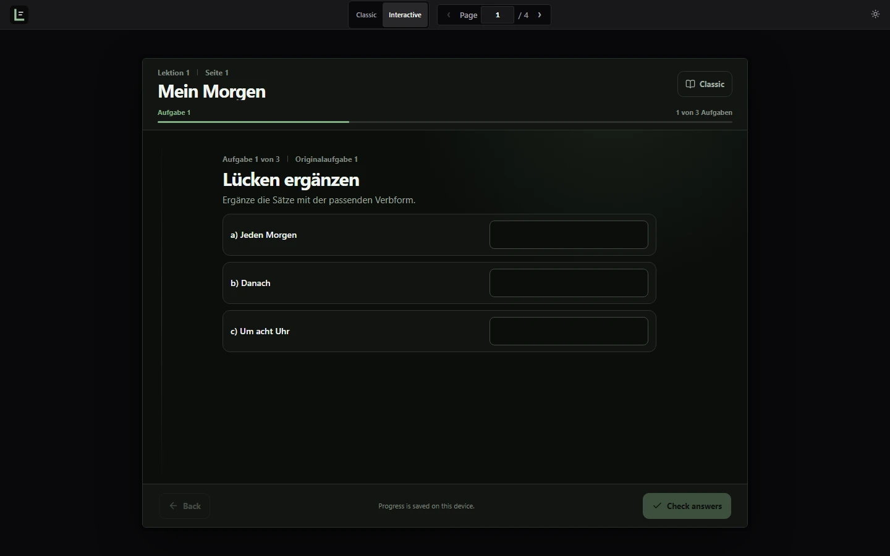
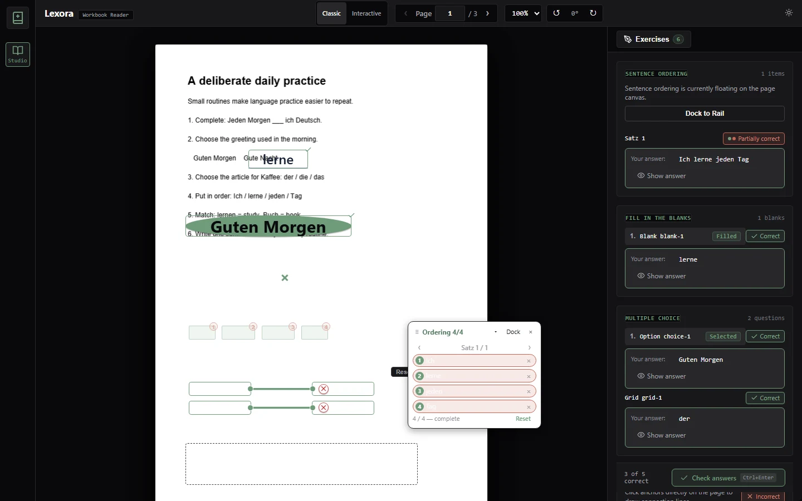
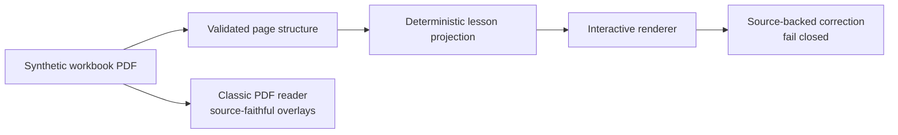

# Lexora

Lexora turns scanned language workbooks into focused, interactive practice while keeping the original page available at any time. Learners can work with native exercises in Interactive Mode or switch to Classic Mode for a source-faithful workbook view.

The repository includes a precomputed public demo using an original four-page synthetic workbook. Run it locally at `http://127.0.0.1:8088/demo`; opening the demo requires no provider credential and triggers no AI inference.

| Interactive lesson | Classic page fidelity |
|---|---|
|  |  |

## Classic and Interactive

| Mode | Best for | How it works |
|---|---|---|
| **Interactive** | Focused practice | Converts supported source exercises into responsive native controls, with deterministic correction when a reliable answer is available. |
| **Classic** | Source fidelity | Preserves the original PDF with geometry-aligned interactive overlays. |

Interactive Mode supports context, fill blank, choice, choice grid, sentence ordering, matching, and free text. Both modes use the same browser-local answers, so learners can switch views without losing progress.

## How it works

1. A workbook page is rasterized for multimodal analysis.
2. The result is validated as a typed page structure with source geometry and interaction identity.
3. Supported structures become native exercises in Interactive Mode.
4. The original page remains available in Classic Mode.

The public demo serves frozen, validated results. New document analysis is available only through the private local workflow.

## Engineering highlights

- **Source fidelity:** Interactive exercises retain their connection to the original page, wording, and geometry.
- **Fail-closed correction:** Only reliable source-backed mappings produce correct or incorrect feedback. Missing or ambiguous answers remain explicitly ungraded.
- **Zero-inference public demo:** Visitors use precomputed multimodal analysis and cannot trigger document processing or provider requests.
- **Tested interaction model:** Automated coverage spans all six exercise families, responsive layouts, keyboard operation, accessibility, correction, and the public read-only boundary.

## Architecture



Lexora separates document analysis from the public reading experience. The public runtime contains only the web app, API, and database; the private local workflow adds multimodal document analysis.

| Layer | Stack | Role |
|---|---|---|
| Web | React, TypeScript, Vite, PDF.js | Public site, Interactive lessons, browser-local progress, and the lazy-loaded Classic reader |
| API | Java, Spring Boot, PostgreSQL, PDFBox | Books, page orchestration, correction authority, and public-demo enforcement |
| Analysis | Python, FastAPI, multimodal AI | Private document analysis and strict structure validation; absent from the public runtime |

See [the architecture reference](docs/architecture.md) for both runtime topologies and [the public release runbook](docs/public-release.md) for operational verification.

## Run the public demo

Prerequisite: Docker Desktop with Compose. No AI service or provider credential is required.

```powershell
$env:POSTGRES_PASSWORD = '<strong-random-secret>'
$env:LEXORA_HTTP_PORT = '8088' # optional
docker compose -p lexora-public -f compose.production.yml up -d --build --wait
```

Open `http://127.0.0.1:8088` for the public site or `http://127.0.0.1:8088/demo` for the reader. The stack binds to loopback by default.

```powershell
docker compose -p lexora-public -f compose.production.yml down
```

For private local document analysis and development setup, follow [the public/private runtime runbook](docs/public-release.md). Credentials and private documents must never be committed.

## Testing and quality

Lexora tests page structures, correction mapping, every interaction family, responsive behavior, keyboard navigation, accessibility, the production shell, and the precomputed public-demo boundary.

```powershell
# Analysis service
docker compose --profile test run --rm --build ai-test

# Backend
cd backend
.\mvnw.cmd test

# Frontend
cd ..\frontend
npm ci
npm test
npm run build
npm run test:e2e
npm run test:e2e:production
npm run test:e2e:public-demo

# Public fixture integrity
cd ..
python scripts/public_demo_geometry.py --check
```

Browser suites cover dark and light themes, reduced motion, keyboard-only interaction, responsive viewports, production-only behavior, and the read-only demo API. The repository's CI runs frontend, backend, analysis-service, and backend/PostgreSQL integration checks.

## Public demo safety

The public demo is intentionally narrow:

- It serves one original synthetic workbook with precomputed multimodal analysis.
- Its production stack contains only `frontend`, `backend`, and `postgres`—no AI service or provider credential.
- Upload, processing, reanalysis, mutation, and access to arbitrary books are blocked.
- Opening the demo cannot trigger inference or create provider spend.
- Private documents, derived captures, provider payloads, credentials, and local storage are excluded from public assets.

The private workflow remains available for authorized local PDFs, but it is not part of the public runtime. See the [release runbook](docs/public-release.md) for the complete boundary.

## Current limitations

- Unsupported or ambiguous layouts remain tied to the source rather than being guessed.
- Free-text responses are saved locally but are not automatically graded without a reliable source answer.
- Authentication, accounts, cloud progress sync, translation, book chat, and generated explanations are not implemented.
- Public hosting, domain configuration, TLS, and operational backups remain deployment responsibilities.
- No license has been selected; until one is added, all rights are reserved.
