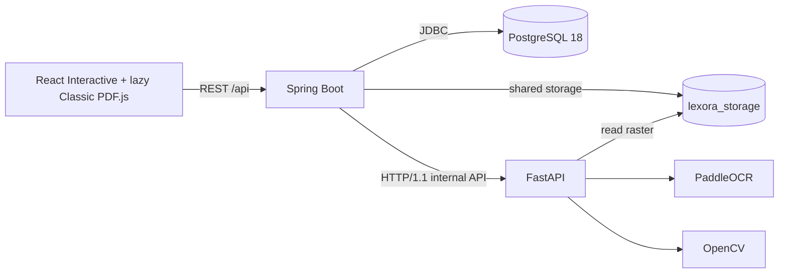

# Lexora Architecture

Lexora is a four-service Docker Compose system with one persisted source pipeline and two reader projections. Interactive Mode converts an analyzed page into a native lesson. Classic Mode preserves the PDF and geometry-aligned overlays. They share answers and correction; neither duplicates OCR or invents source content.

## Runtime Topology



Docker Compose runs `frontend`, `backend`, `ai-service`, and `postgres`. Spring Boot and FastAPI share the `lexora_storage` volume so the internal analysis request can pass an absolute raster path without copying image bytes over HTTP.

## Responsibilities

### React Frontend

- Projects a `READY` `PageAnalysis` into a page-scoped discriminated `Lesson` model with context, fill, choice, grid, ordering, matching, and free-text blocks.
- Carries source provenance on projected blocks: book/page identity, source span or interaction IDs, normalized geometry, confidence, schema version, and processor methods.
- Renders Interactive Mode as semantic native controls independent of PDF canvas geometry.
- Keeps Classic Mode as the source-faithful reader and loads its PDF.js runtime only when Classic is requested.
- Uses one versioned answer store and the same correction response in both modes.
- Treats absent, stale, failed, or unsupported analysis as explicit UI state; projection fails closed instead of fabricating a lesson.
- Restores the current book, selected page, source PDF, and debug preferences from local state.
- Shows a `react-loading-skeleton` page placeholder while restoration requests complete.
- Renders the original PDF page with PDF.js and a device-pixel-ratio backing store.
- Positions OCR boxes, exercise inputs, and choice targets as CSS percentages inside the exact displayed canvas wrapper.
- Scales typed text and selected choice values from the current PDF.js viewport and normalized interaction geometry.
- Loads persisted page state whenever the selected page changes.
- Starts processing only after an explicit user action.
- Polls persisted coarse stages while the synchronous processing request runs.
- Shows an in-page analysis overlay with real stage labels while a rendered page is processed, with a CSS-only scan beam that is disabled under `prefers-reduced-motion`.
- Persists structured exercise answers in versioned `localStorage` keyed by book, page, and stable interaction fingerprint.
- Reuses `READY` analysis immediately, offers retry for `FAILED`, exposes an explicit **Update analysis** action for any `READY` page with persisted analysis, and never requests processing merely because a page was opened.

### Spring Boot Backend

- Validates and stores uploaded PDFs under UUID-based keys.
- Reads PDF page count and rasterizes a selected page at 300 DPI with PDFBox.
- Atomically claims an unprocessed or `FAILED` page before work begins. A user-requested analysis update may also claim `READY`.
- Persists observable page stages before each real orchestration step.
- Calls separate FastAPI OCR and interaction-detection operations over HTTP/1.1 and stores only the final analysis as PostgreSQL JSONB.
- Returns an existing `READY` page without rasterization or OCR.
- Streams the stored source PDF for browser restoration.
- Resolves page interactions against the imported answer-key profile and returns authoritative per-interaction answer slots plus the resolved unit title.
- Applies Flyway migrations for books, pages, legacy processing-status conversion, and the `DETECTING_INTERACTIONS` stage rename.

### FastAPI AI Service

- Opens the PDFBox raster and records its source dimensions.
- Runs PaddleOCR 3.7 with the German language configuration.
- Converts detected line or word boxes to normalized `[0,1]` coordinates.
- Detects graphical horizontal answer lines with adaptive thresholding, morphology, and OCR spatial context.
- Detects hollow circular choice markers and numbered option legends with contour analysis and OCR spatial context.
- Detects interactive choice grids (rows with empty answer cells under short column headers) with line morphology, cell-emptiness checks, and OCR spatial context, while rejecting static/explanatory tables.
- Detects sentence-ordering, matching, and free-text interactions in addition to blanks, choices, and choice grids.
- Returns OCR spans, all supported interaction structures, normalized geometry, and concise processor metadata.

PaddleOCR document orientation classification, document unwarping, and text-line orientation are intentionally disabled. Those transforms can change pixel geometry even when output dimensions remain unchanged, which would detach OCR boxes from the original PDF page.

### PostgreSQL

- Stores book metadata relationally in `books`.
- Stores one attempted/processed row per `(book_id, page_number)` in `book_pages`.
- Stores analysis as JSONB in `book_pages.analysis`.
- Makes page state and completed analysis available after navigation or refresh.

## Page Processing

Processing is explicit and synchronous at the HTTP boundary, but stage writes are committed separately and can be observed by frontend polling.

```text
PENDING
  -> RASTERIZING
  -> OCR
  -> DETECTING_INTERACTIONS
  -> PERSISTING
  -> READY
```

Any orchestration failure produces `FAILED`. `OCR` and `DETECTING_INTERACTIONS` are separate FastAPI requests, so both stages correspond to real work. The interaction request runs blank detection and choice-marker detection on the same raster in one operation. The frontend shows the current stage as a label over the PDF page; it does not display a numerical percentage.

The processing claim is idempotent:

- `READY`: return the persisted page unchanged.
- Active stage: return the current page; do not start concurrent OCR.
- Missing page: create and claim it.
- `FAILED`: clear the failed attempt and claim a retry.
- `READY` with persisted analysis: expose an explicit re-analysis action that claims the page with `refreshAnalysis=true`; never reprocess automatically.

## Internal Contract

Spring calls:

```http
POST /internal/document-analysis/pages
Content-Type: application/json

{
  "bookId": "uuid",
  "pageNumber": 10,
  "imagePath": "/app/storage/pdf/key-page10-300dpi.png"
}
```

Spring deserializes the OCR response into the Java `PageAnalysis` contract, then calls:

```http
POST /internal/document-analysis/pages/interactions
Content-Type: application/json

{
  "imagePath": "/app/storage/pdf/key-page10-300dpi.png",
  "analysis": { "schemaVersion": "0.2.0", "exerciseBlanks": [] }
}
```

The second request runs interaction detection and returns the completed v0.2 analysis, which Spring persists as JSONB. This persisted object is the sole source for both reader modes. See [`page-analysis.md`](page-analysis.md) and the interaction-specific documents in this directory.

## Interactive Lesson Projection

`projectLesson` is a pure frontend boundary between source analysis and presentation:

```text
Persisted PageAnalysis
  -> validate page-scoped source data
  -> group nearby OCR context and interactions
  -> emit provenance-bearing Lesson blocks
  -> render native semantic controls
```

The projector does not call OCR, correction, or a generative model. It preserves stable interaction IDs so the existing answer fingerprints and backend correction mappings remain authoritative. When several interactions share nearby text, prompts are assigned by source geometry rather than copied across exercises.

## Correction Safety

The browser requests page-scoped correction slots from the backend. The backend owns answer-key-to-interaction resolution and returns `RESOLVED`, `AMBIGUOUS`, or `UNMAPPED` slots with authoritative expected values only when resolution succeeds. The frontend compares the browser-local learner answer against a resolved slot using the slot's normalization policy, producing `CORRECT`, `INCORRECT`, `UNANSWERED`, or `NOT_AUTO_GRADABLE`. It never compares against an ambiguous, unmapped, stale, or failed response. Page identity binds the correction payload, and navigation revokes the previous page's authority before the next request starts. Reveal and retry use that same page-bound payload and shared answer state.

## Mode Boundary and Performance

Interactive Mode is the default native reading experience for analyzed pages. Classic remains available for exact page fidelity, unsupported content, and debugging. `PageViewer` is a lazy chunk, so Interactive startup does not download or initialize PDF.js; changing mode is the explicit boundary that loads it.

## Current Boundaries

Interactive Mode covers the interaction types already present in `PageAnalysis`; it does not convert every possible publisher layout. Answer-key gaps stay `UNMAPPED` or `AMBIGUOUS`. Translation, vocabulary storage, VLM analysis, RAG, authentication, generated explanations, and background multi-page processing remain outside the MVP.
