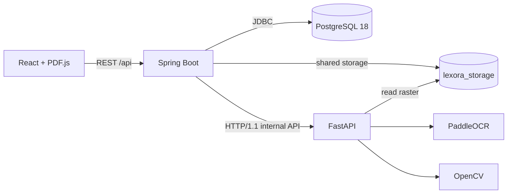

# Lexora Architecture

Lexora is a four-service Docker Compose system that preserves the original PDF as the visual source of truth and adds persisted OCR, interactive blank geometry, and choice-marker targets per page. PoC 1 established the pipeline and fill-in blanks; PoC 2 added choice-marker interactions.

## Runtime Topology



Docker Compose runs `frontend`, `backend`, `ai-service`, and `postgres`. Spring Boot and FastAPI share the `lexora_storage` volume so the internal analysis request can pass an absolute raster path without copying image bytes over HTTP.

## Responsibilities

### React Frontend

- Restores the current book, selected page, source PDF, and debug preferences from local state.
- Shows a `react-loading-skeleton` page placeholder while restoration requests complete.
- Renders the original PDF page with PDF.js and a device-pixel-ratio backing store.
- Positions OCR boxes, exercise inputs, and choice targets as CSS percentages inside the exact displayed canvas wrapper.
- Scales typed text and selected choice values from the current PDF.js viewport and normalized interaction geometry.
- Loads persisted page state whenever the selected page changes.
- Starts processing only after an explicit user action.
- Polls persisted coarse stages while the synchronous processing request runs.
- Shows an in-page analysis overlay with real stage labels while a rendered page is processed, with a CSS-only scan beam that is disabled under `prefers-reduced-motion`.
- Persists exercise answers (fill-in text and choice option IDs) in versioned `localStorage` keyed by book, page, and stable interaction fingerprint.
- Reuses `READY` analysis immediately, offers retry for `FAILED`, exposes **Update analysis** for legacy and pre-PoC 2 analyses, and never requests processing merely because a page was opened.

### Spring Boot Backend

- Validates and stores uploaded PDFs under UUID-based keys.
- Reads PDF page count and rasterizes a selected page at 300 DPI with PDFBox.
- Atomically claims an unprocessed or `FAILED` page before work begins. A user-requested analysis update may also claim `READY`.
- Persists observable page stages before each real orchestration step.
- Calls separate FastAPI OCR and interaction-detection operations over HTTP/1.1 and stores only the final analysis as PostgreSQL JSONB.
- Returns an existing `READY` page without rasterization or OCR.
- Streams the stored source PDF for browser restoration.
- Applies Flyway migrations for books, pages, legacy processing-status conversion, and the `DETECTING_INTERACTIONS` stage rename.

### FastAPI AI Service

- Opens the PDFBox raster and records its source dimensions.
- Runs PaddleOCR 3.7 with the German language configuration.
- Converts detected line or word boxes to normalized `[0,1]` coordinates.
- Detects graphical horizontal answer lines with adaptive thresholding, morphology, and OCR spatial context.
- Detects hollow circular choice markers and numbered option legends with contour analysis and OCR spatial context.
- Returns text, exercise blanks, choice targets/groups, normalized geometry, and concise processor metadata.

PaddleOCR document orientation classification, document unwarping, and text-line orientation are intentionally disabled. Those transforms can change pixel geometry even when output dimensions remain unchanged, which would detach OCR boxes from the original PDF page.

### PostgreSQL

- Stores book metadata relationally in `books`.
- Stores one attempted/processed row per `(book_id, page_number)` in `book_pages`.
- Stores analysis as JSONB in `book_pages.analysis`.
- Makes page state and completed analysis available after navigation or refresh.

## Page Processing

Processing is explicit and synchronous at the HTTP boundary, but stage writes are committed separately and can be observed by frontend polling.

```text
PENDING
  -> RASTERIZING
  -> OCR
  -> DETECTING_INTERACTIONS
  -> PERSISTING
  -> READY
```

Any orchestration failure produces `FAILED`. `OCR` and `DETECTING_INTERACTIONS` are separate FastAPI requests, so both stages correspond to real work. The interaction request runs blank detection and choice-marker detection on the same raster in one operation. The frontend shows the current stage as a label over the PDF page; it does not display a numerical percentage.

The processing claim is idempotent:

- `READY`: return the persisted page unchanged.
- Active stage: return the current page; do not start concurrent OCR.
- Missing page: create and claim it.
- `FAILED`: clear the failed attempt and claim a retry.
- Legacy `READY` or pre-PoC 2 v0.2 `READY` (no choice detection): expose an explicit update action; do not reprocess automatically.

## Internal Contract

Spring calls:

```http
POST /internal/document-analysis/pages
Content-Type: application/json

{
  "bookId": "uuid",
  "pageNumber": 10,
  "imagePath": "/app/storage/pdf/key-page10-300dpi.png"
}
```

Spring deserializes the OCR response into the Java `PageAnalysis` contract, then calls:

```http
POST /internal/document-analysis/pages/interactions
Content-Type: application/json

{
  "imagePath": "/app/storage/pdf/key-page10-300dpi.png",
  "analysis": { "schemaVersion": "0.2.0", "exerciseBlanks": [] }
}
```

The second request runs blank and choice-marker detection and returns the completed v0.2 analysis, which Spring persists as JSONB. See [`page-analysis.md`](page-analysis.md) and [`choice-interactions.md`](choice-interactions.md).

## Current Boundaries

PoC 2 detects horizontal fill-in lines and hollow circular choice markers. It does not include answer validation, translation, vocabulary storage, VLM analysis, RAG, authentication, or background multi-page jobs.
