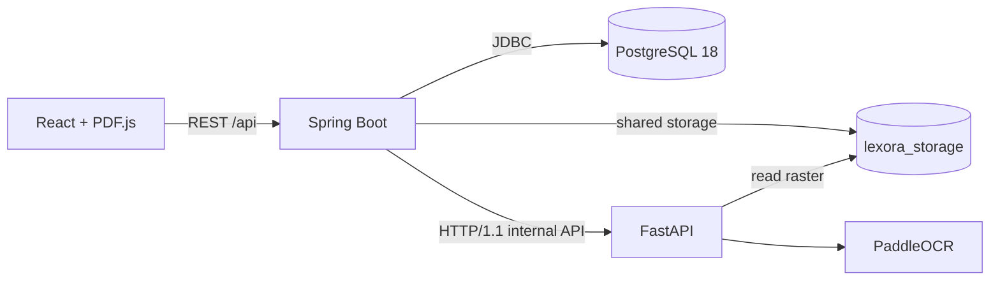

# PoC 0 Architecture

Lexora PoC 0 is a four-service Docker Compose system that preserves the original PDF as the visual source of truth and adds persisted OCR geometry per page.

## Runtime Topology



Docker Compose runs `frontend`, `backend`, `ai-service`, and `postgres`. Spring Boot and FastAPI share the `lexora_storage` volume so the internal analysis request can pass an absolute raster path without copying image bytes over HTTP.

## Responsibilities

### React Frontend

- Restores the current book, selected page, source PDF, and OCR-box preference from local state.
- Shows a `react-loading-skeleton` page placeholder while restoration requests complete.
- Renders the original PDF page with PDF.js and a device-pixel-ratio backing store.
- Positions normalized boxes as CSS percentages inside the exact displayed canvas wrapper.
- Loads persisted page state whenever the selected page changes.
- Starts processing only after an explicit user action.
- Polls persisted coarse stages while the synchronous processing request runs.
- Reuses `READY` analysis immediately, offers retry for `FAILED`, and never requests processing merely because a page was opened.

### Spring Boot Backend

- Validates and stores uploaded PDFs under UUID-based keys.
- Reads PDF page count and rasterizes a selected page at 300 DPI with PDFBox.
- Atomically claims an unprocessed or `FAILED` page before work begins.
- Persists observable page stages before each real orchestration step.
- Calls FastAPI over HTTP/1.1 and stores the returned analysis as PostgreSQL JSONB.
- Returns an existing `READY` page without rasterization or OCR.
- Streams the stored source PDF for browser restoration.
- Applies Flyway migrations for books, pages, and legacy processing-status conversion.

### FastAPI AI Service

- Opens the PDFBox raster and records its source dimensions.
- Runs PaddleOCR 3.7 with the German language configuration.
- Converts detected line or word boxes to normalized `[0,1]` coordinates.
- Returns text, confidence, geometry, and processor metadata.

PaddleOCR document orientation classification, document unwarping, and text-line orientation are intentionally disabled. Those transforms can change pixel geometry even when output dimensions remain unchanged, which would detach OCR boxes from the original PDF page.

### PostgreSQL

- Stores book metadata relationally in `books`.
- Stores one attempted/processed row per `(book_id, page_number)` in `book_pages`.
- Stores analysis as JSONB in `book_pages.analysis`.
- Makes page state and completed analysis available after navigation or refresh.

## Page Processing

Processing is explicit and synchronous at the HTTP boundary, but stage writes are committed separately and can be observed by frontend polling.

```text
PENDING (5%)
  -> RASTERIZING (15%)
  -> OCR (50%)
  -> PERSISTING (95%)
  -> READY (100%)
```

Any orchestration failure produces `FAILED`. FastAPI performs both OCR and coordinate normalization during the `OCR` stage; there is no separate public `NORMALIZING` stage because Spring receives no real intermediate event from that synchronous call.

The processing claim is idempotent:

- `READY`: return the persisted page unchanged.
- Active stage: return the current page; do not start concurrent OCR.
- Missing page: create and claim it.
- `FAILED`: clear the failed attempt and claim a retry.

## Internal Contract

Spring calls:

```http
POST /internal/document-analysis/pages
Content-Type: application/json

{
  "bookId": "uuid",
  "pageNumber": 10,
  "imagePath": "/app/storage/pdf/key-page10-300dpi.png"
}
```

The response body is persisted unchanged as JSONB. See [`page-analysis.md`](page-analysis.md).

## Current Boundaries

PoC 0 does not include exercise detection, interactive inputs, translation, vocabulary storage, VLM analysis, RAG, authentication, or background multi-page jobs.
