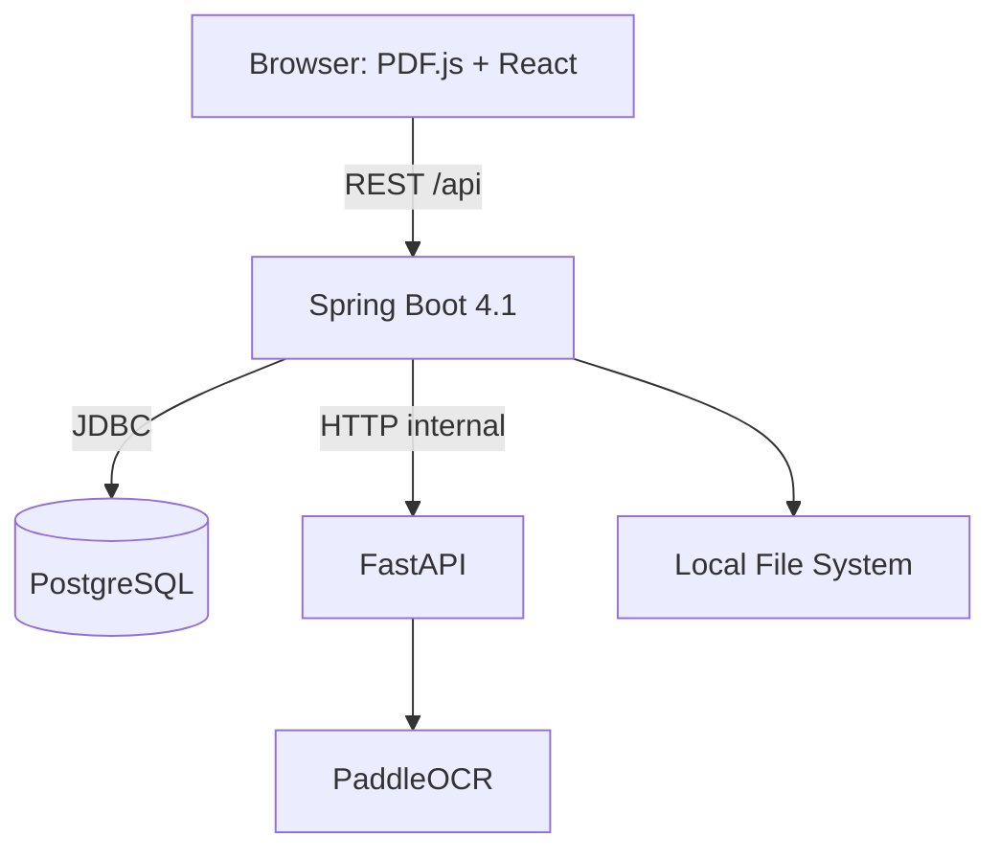

# Architecture

## High-level



## Responsibilities

### React Frontend

- Renders the original PDF page via PDF.js canvas
- Positions OCR text span overlays using normalized coordinates
- Manages zoom (75%–150%) with transform utilities
- Debug panel for inspecting selected spans

### Spring Boot Backend

- Book upload, listing, and page navigation via REST API
- PDF validation (MIME, extension, size, checksum)
- PDF page rasterization via PDFBox for OCR input
- Coordinates OCR processing: sends PNG to Python, persists PageAnalysis
- Flyway migrations for `books` and `book_pages` tables

### Python AI Service

- Receives page rasterization requests from Spring
- Runs PaddleOCR with German language model
- Normalizes pixel coordinates to [0,1] range
- Returns PageAnalysis with text spans, confidence, bboxes, and processor metadata

### PostgreSQL

- Stores book metadata relationally
- Stores PageAnalysis as JSONB in `book_pages.analysis`
- Enables retrieval without reprocessing on page refresh

## File Storage

PDFs are stored locally under `storage/pdf/` with UUID-based keys. Never use the original filename as a filesystem path.

## Service Contract

Spring sends to Python's internal endpoint:

```
POST /internal/document-analysis/pages
{
  "bookId": "uuid",
  "pageNumber": 5,
  "imagePath": "/app/storage/pdf/key-page5.png"
}
```

Python responds with PageAnalysis JSON (see `docs/page-analysis.md`).

## OCR Choice

PaddleOCR 3.7.0 was chosen over Surya, Docling, and Marker because:

| Criterion | PaddleOCR | Surya | Docling | Marker |
|---|---|---|---|---|
| German support | Yes (PP-OCRv6 unified model) | Yes (89.7%) | Dependent on backend | Via Surya |
| Word-level boxes | CTC-derived spans | Block-level only | Backend-dependent | Block-level only |
| Local CPU | Yes | Requires llama.cpp server | Yes | Requires Surya server |
| License | Apache-2.0 | Weight: OpenRAIL-M commercial restrictions | MIT (code) | Weight: OpenRAIL-M commercial restrictions |
| Confidence | Line-level recognition confidence | Block-level token probability | Backend-dependent | None in normal output |

PaddleOCR was the only option that directly returns clickable word-level geometry with documented confidence values from a fully local CPU pipeline with no VLM server requirement and a clean Apache-2.0 license.

Known limitation: confidence is per-line, not per-word. Word spans inherit their parent line's recognition confidence.
